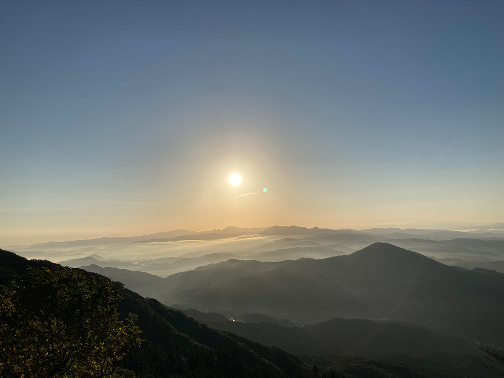

## 谷口 瑶光  
### Youkou TANIGUCHI  
IT Engineer  

I was born in 1987, Japan. I started drawing and programming when I was a child.  
Since graduating from an university, I've been developing backbone systems of local governments and companies in the IT industry.  
**[Blog](https://yokotamanoko.blogspot.com)** | **[Instagram](https://www.instagram.com/yokotamanoko/)** | **[Twitter](https://twitter.com/yokotamanoko)**

___
### Deity, Buddha and Radiance

My life theme is "Radiance".  
There are many difficulties in this world. I approach the problems by creating arts focus on Radiance.  

___
### My Projects

- [東風 (KOCHI)](https://www.kochifukaba.jp/) ... It's the video game under development by [Zelkova Research Institute](https://note.com/zelkova_inst/).

___
**[Contact Form](https://forms.gle/HMVYyZf8vrsakRoC6)**  

&copy; 2019-2021 [yokotamanoko.com](https://yokotamanoko.com)
